# SISOP-4-2026-IT-069

### Helen Audya Yuniarini (5027251069)
---
### Soal 1: Save Asisten Kenz
---
#### Deskripsi Soal
Pada soal 1 Save Asisten Kenz ini, diminta untuk membuat file system berbasis FUSE bernama `kenz_rescue.c`. Filesystem tersebut sebagai passthrough filesystem yang menampilkan file asli dari source directory ke mount directory.

Source directory berisi file `1.txt` hingga `7.txt` yang berasal dari arsip ekspedisi Mas Amba, kemudian diminta untuk menampilkan seluruh file tersebut pada mount directory tanpa mengubah isi aslinya. Setelah itu diminta untuk membuat satu file virtual bernama `tujuan.txt` yang mana file ini tidak boleh benar-benar ada pada source directory, tetapi harus muncul pada mount directory. 

Isi dari `tujuan.txt` dibuat secara on-the-fly dengan membaca seluruh file dengan cara membaca seluruh file `1.txt` hingga `7.txt`, mengambil fragment yang diawali dengan `KOORD; `, kemudian menggabungkan seluruh fragment tersebut menjadi satu string dengan format:

`Tujuan Mas Amba: <gabungan_fragment>`

Menggunakan callback dasar FUSE seperti:
- getattr
- readdir
- open
- read
serta memastikan file virtual dapat diakses menggunakan perintah seperti `ls`, `cat`, dan `stat`.
#### Langkah Pengerjaan dan Output yang dihasilkan
1. Menyiapkan Source Directory dan input `amba_files`

    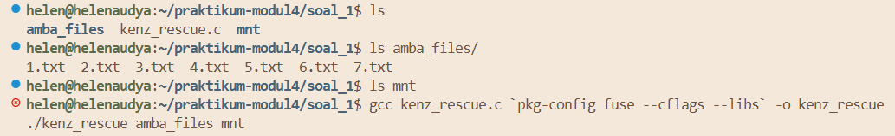
    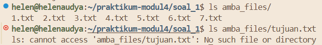
    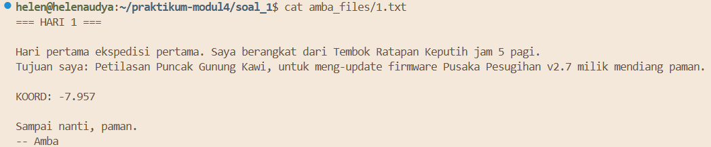
    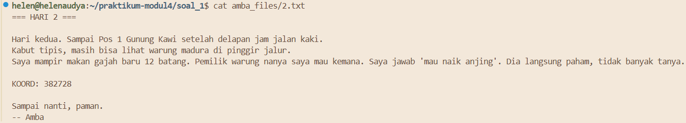
    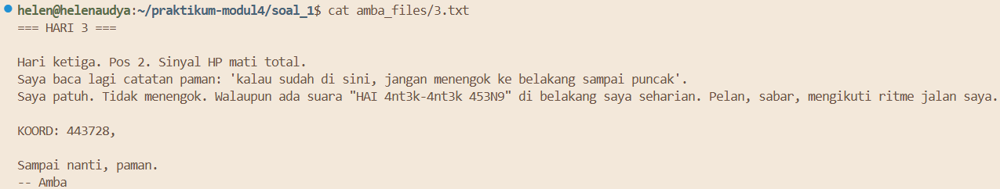
    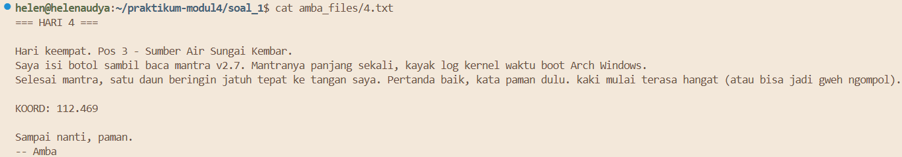
    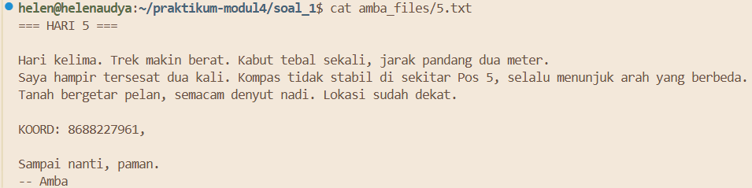
    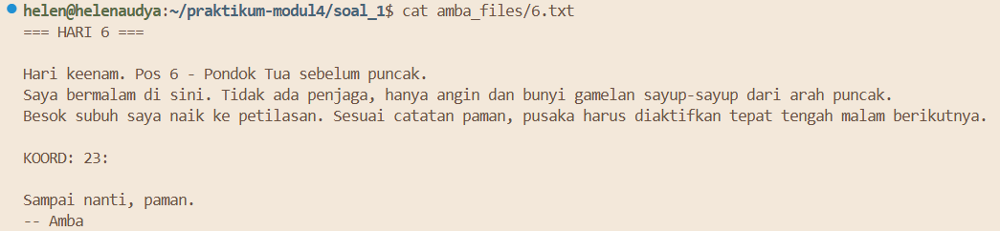
    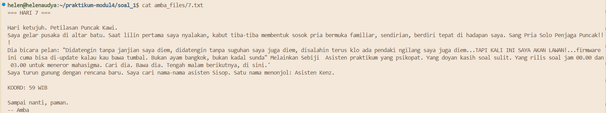

2. Membuat fungsi fullpath()

    Digunakan untuk menggabungkan source directory dengan path dari filesystem FUSE.
    ```
        void fullpath(char fpath[1024], const char *path)
    {
        sprintf(fpath, "%s%s", source_dir, path);
    }
    ```
3. Callback getattr

    Digunakan untuk mengambil metadata file. Untuk file biasa, metadata `tujuan.txt` dibuat secara manual.
    ```
    static int xmp_getattr(const char *path, struct stat *stbuf)
    {

        int res;

        memset(stbuf, 0, sizeof(struct stat));

        // FILE VIRTUAL
        if (strcmp(path, "/tujuan.txt") == 0)
        {
            stbuf->st_mode = S_IFREG | 0444;
            stbuf->st_nlink = 1;
            stbuf->st_size = 4096;

            return 0;
        }

        char fpath[1024];

        fullpath(fpath, path);

        res = lstat(fpath, stbuf);

        if (res == -1)
            return -errno;

        return 0;
    }
    ```
4. Callback readdir

    Digunakan untuk menampilkan isi direktori. Seluruh file pada source directory dibaca menggunakan `readdir()`, kemudian menambahkan file virtual `tujuan.txt` menggunakan `filler()`.
    ```
     filler(buf, "tujuan.txt", NULL, 0);
    ```
    Maka file virtual akan muncul ketika menjalankan perintah: `ls mnt`.
    ```
    static int xmp_readdir(const char *path, void *buf, fuse_fill_dir_t filler,
                        off_t offset, struct fuse_file_info *fi)
    {
        (void) offset;
        (void) fi;

        DIR *dp;
        struct dirent *de;

        char fpath[1024];
        fullpath(fpath, path);

        dp = opendir(fpath);

        if (dp == NULL)
            return -errno;

        while ((de = readdir(dp)) != NULL)
        {
            struct stat st;

            memset(&st, 0, sizeof(st));

            st.st_ino = de->d_ino;
            st.st_mode = de->d_type << 12;

            if (filler(buf, de->d_name, &st, 0))
                break;
        }

        closedir(dp);
        filler(buf, "tujuan.txt", NULL, 0);
        return 0;
    }
    ```
5. Callback open

    Digunakan untuk membuka file, untuk file virtual `tujuan.txt`, dilakukan pengecekan agar file dapat dibuka meskipun tidak benar-benar ada pada source directory.
    ```
        static int xmp_open(const char *path,
                        struct fuse_file_info *fi)
    {
        // FILE VIRTUAL
        if (strcmp(path, "/tujuan.txt") == 0)
            return 0;

        int res;

        char fpath[1024];
        fullpath(fpath, path);

        res = open(fpath, fi->flags);

        if (res == -1)
            return -errno;

        close(res);

        return 0;
    }
    ```
6. Callback read

    Digunakan untuk membaca isi file. File `tujuan.txt` akan dibaca setelah program melakukan:
    - membaca file `1.txt` sampai `7.txt`
    - mengambil bagian yang diawali `KOORD: `
    - menggabungkan seluruh fragment
    - menampilkan hasil dengan format:
    `Tujuan Mas Amba: <gabungan_fragment>`

    Implementasi:
    ```
        static int xmp_read(const char *path,
                        char *buf,
                        size_t size,
                        off_t offset,
                        struct fuse_file_info *fi)
    {
        (void) fi;

        // FILE VIRTUAL
        if (strcmp(path, "/tujuan.txt") == 0)
        {
            static char content[4096];

            strcpy(content, "Tujuan Mas Amba: ");

            for (int i = 1; i <= 7; i++)
            {
                char filepath[1024];
                snprintf(filepath, sizeof(filepath), "%s/%d.txt", source_dir, i);

                FILE *fp = fopen(filepath, "r");

                if (!fp)
                    continue;

                char line[256];

                while (fgets(line, sizeof(line), fp))
                {
                    if (strncmp(line, "KOORD:", 6) == 0)
                    {
                        char *frag = line + 6;

                        while (*frag == ' ')
                            frag++;

                        frag[strcspn(frag, "\n")] = '\0';

                        strcat(content, frag);
                    }
                }

                fclose(fp);
            }

            strcat(content, "\n");

            size_t len = strlen(content);

            if (offset < len)
            {
                if (offset + size > len)
                    size = len - offset;

                memcpy(buf, content + offset, size);
            }
            else
            {
                size = 0;
            }

            return size;
        }

        int fd;
        int res;

        char fpath[1024];
        fullpath(fpath, path);

        fd = open(fpath, O_RDONLY);

        if (fd == -1)
            return -errno;

        res = pread(fd, buf, size, offset);

        if (res == -1)
            res = -errno;

        close(fd);

        return res;
    }
    ```
7. Struktur fuse_operations dan Main Function

    Program menggunakan struktur `fuse_operations` untuk menghubungkan callback function dengan operasi filesystem FUSE.
    ```
        static const struct fuse_operations xmp_oper = {
        .getattr = xmp_getattr,
        .readdir = xmp_readdir,
        .open = xmp_open,
        .read = xmp_read,
    };
    ```
    - `getattr` digunakan untuk mengambil metadata file
    - `readdir` digunakan untuk membaca isi direktori
    - `open` digunakan saat file dibuka
    - `read` digunakan untuk membaca isi file
    
    Pada fungsi `main`, program menerima parameter source directory dan mount point.
    ```
        int main(int argc, char *argv[])
    {
        if (argc < 3)
        {
            fprintf(stderr, "Usage: %s <source_dir> <mount_point>\n", argv[0]);
            return 1;
        }

        realpath(argv[1], source_dir);

        for (int i = 1; i < argc - 1; i++)
        {
            argv[i] = argv[i + 1];
        }

        argc--;

        return fuse_main(argc, argv, &xmp_oper, NULL);
    }
    ```
8. Compile program

    Program dikompilasi menggunakan:
    ```
    gcc kenz_rescue.c `pkg-config fuse --cflags --lib``s` -o kenz_rescue
    ```
    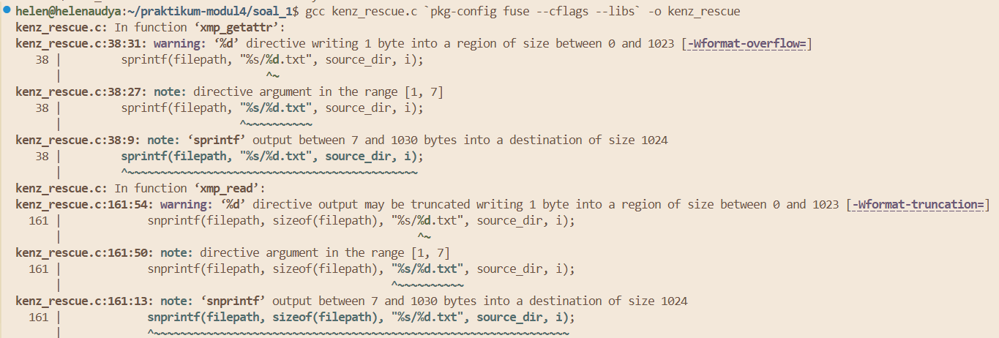

9. Menjalankan Filesystem

    Filesystem dijalankan menggunakan:
    ```
    ./kenz_rescue amba_files mnt
    ```
    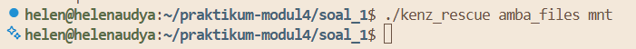

    Kemudian menjalankan terminal baru.

#### Output
1. Output `ls` pada mount directory

    `ls mnt`

    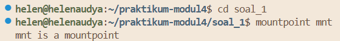
    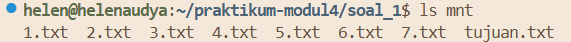

    Menunjukkan apabila seluruh file asli berhasil ditampilkan dan file virtual `tujuan.txt` berhasil dibuat.

2. Output passthrough file
    `cat mnt/1-7.txt`

    Output yang ditampilkan identik dengan isi file asli pada source directory.
    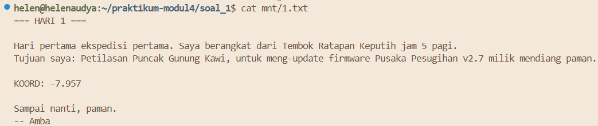
    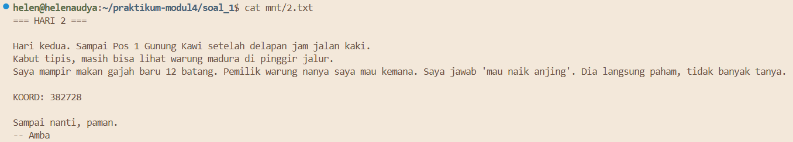
    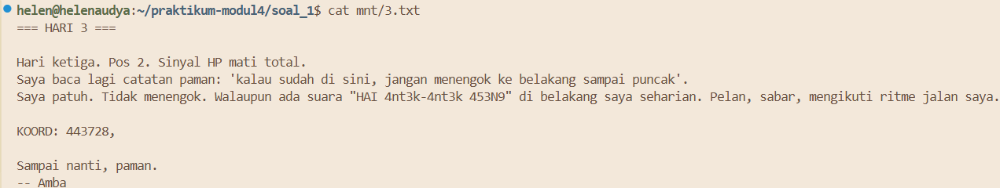
    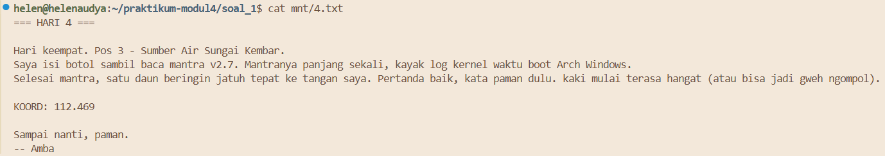
    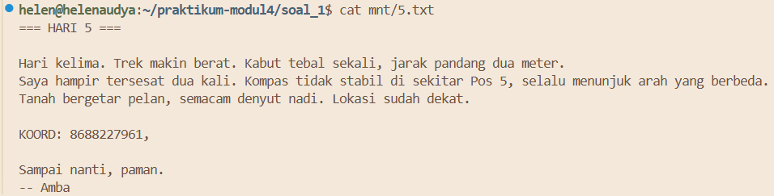
    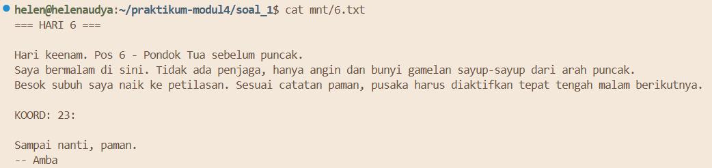
    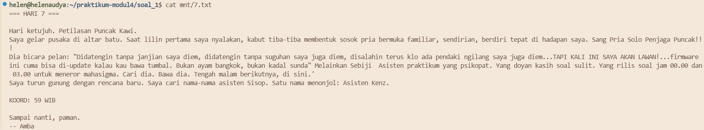

    Melakukan pengujian menggunakan:
    ```
    for i in 1 2 3 4 5 6 7; do
        diff mnt/$i.txt amba_files/$i.txt && echo "$i.txt OK"
    done
    ```
    Output:
    
    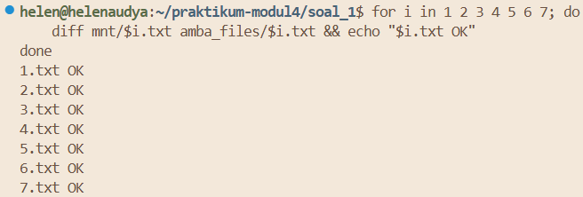

    Menunjukkan bahwa filesystem passthrough berjalan dengan benar dan isi file pada mount directory identik dengan source directory.

3. Output saat diuji menggunakan `stat mnt/tujuan.txt` dan `wc -c mnt/tujuan.txt`

    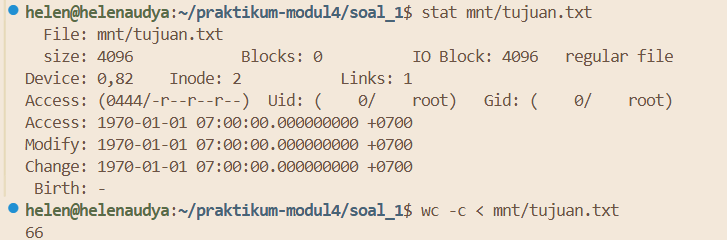

4. Output file virtual `tujuan.txt` dan
    `cat mnt/tujuan.txt`

    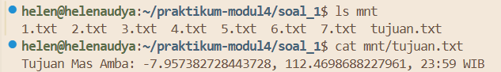

    Menunjukkan bahwa file virtual berhasil dibuat secara on-the-fly tanpa benar-benar disimpan pada source directory.

5. Unmount Filesystem

    Setelah proses pengujian selesai, filesystem FUSE dilepas dari mount point menggunakan : 
    ```
    fusermount -u mnt
    ```
    Perintah tersebut digunakan untuk menghentikan filesystem virtual dan melepaskan mount point `mnt`.

    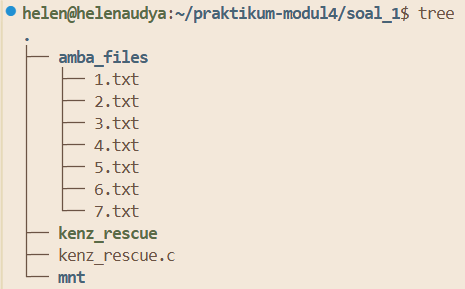

    Setelah dilakukan unmount, file virtual seperti `tujuan.txt` tidak dapat lagi di akses.

    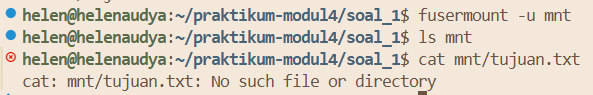

#### Kendala yang dialami
Selama proses pengerjaan praktikum, terdapat beberapa kendala yang dialami, antara lain:

1. Sempat mengira filesystem FUSE tidak berjalan setelah menjalankan:

    `./kenz_Rescue amba_files mnt` 

    karena terminal terlihat diam dan tidak menampilkan output apapun. Setelah dilakukan pengecekan, ternyata filesystem memang berjalan dan pengujian harus dilakukan menggunakan terminal baru.
    
2. File virtual `tujuan.txt` awalnya tidak muncul pada mount directory karena belum menambahkan
    ```
    filler(buf, "tujuan.txt", NULL, 0);
    ```
    pada callback `readdir`.

3. File virtual `tujuan.txt` sempat tidak dapat diakses menggunakan perintah `cat` karena callback `getattr` dan `open` belum menangani file virtual secara khusus.

#### Revisi
Pada saat pengujian menggunakan:

```
stat mnt/tujuan.txt
```

dan:

```
wc -c mnt/tujuan.txt
```

terjadi kesalahan berupa ukuran file pada metadata tidak sama dengan jumlah asli isi file virtual.


Hal ini terjadi karena sebelumnya ukuran file virtual diatur secara statis menggunakan:

```
stbuf->st_size = 4096;
```

Akibatnya, output `stat` menunjukkan ukuran file sebesar 4096 byte, sedangkan hasil `wc -c` menunjukkan ukuran sebenarnya.

Untuk memperbaikinya, ukuran file virtual diubah menjadi dinamis menggunakan
```
stbuf->st_size = strlen(content);
```
Setelah melakukan perubahan tersebut, ukuran file pada metadata menjadi sesuai dengan panjang isi file virtual yang sebenarnya.
```
static int xmp_getattr(const char *path, struct stat *stbuf)
{

    int res;

     memset(stbuf, 0, sizeof(struct stat));

    // FILE VIRTUAL
    if (strcmp(path, "/tujuan.txt") == 0)
{
    char content[4096];

    strcpy(content, "Tujuan Mas Amba: ");

    for (int i = 1; i <= 7; i++)
    {
        char filepath[1024];
        sprintf(filepath, "%s/%d.txt", source_dir, i);

        FILE *fp = fopen(filepath, "r");

        if (!fp)
            continue;

        char line[256];

        while (fgets(line, sizeof(line), fp))
        {
            if (strncmp(line, "KOORD:", 6) == 0)
            {
                char *frag = line + 6;

                while (*frag == ' ')
                    frag++;

                frag[strcspn(frag, "\n")] = '\0';

                strcat(content, frag);
            }
        }

        fclose(fp);
    }

    strcat(content, "\n");

    stbuf->st_mode = S_IFREG | 0444;
    stbuf->st_nlink = 1;
    stbuf->st_size = strlen(content);

    return 0;
}

    char fpath[1024];

    fullpath(fpath, path);

    res = lstat(fpath, stbuf);

    if (res == -1)
        return -errno;

    return 0;
}
```
Output:

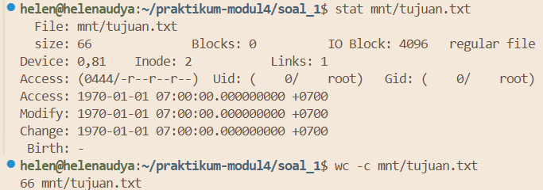